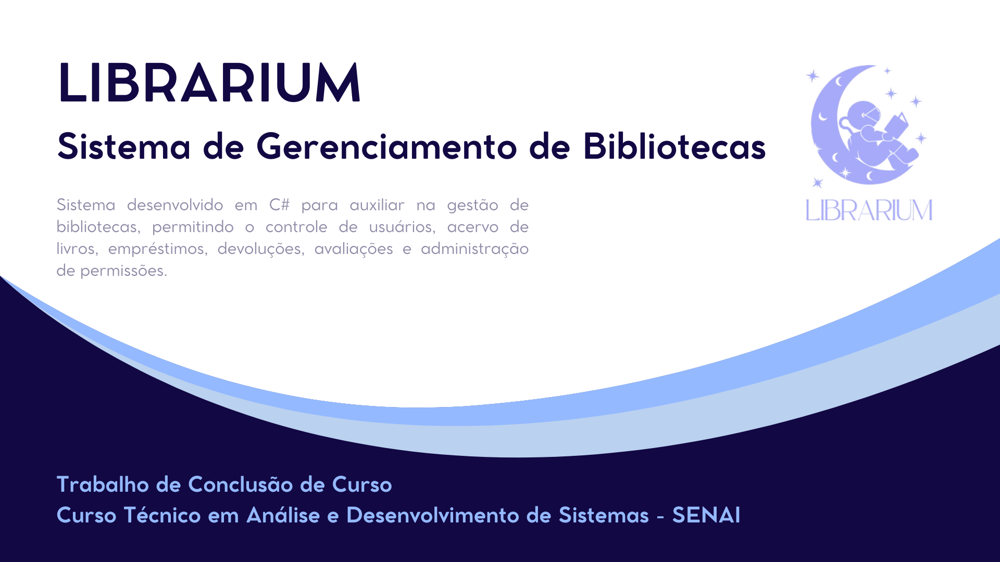

  

---

## 💡 Sobre o projeto  

O **LIBRARIUM** é um sistema desktop desenvolvido como Trabalho de Conclusão de Curso, com foco na **organização e automação de bibliotecas**.

A aplicação permite gerenciar livros, usuários, empréstimos e devoluções de forma simples e eficiente, sendo ideal para ambientes que precisam de uma solução **local (offline)**.

---

## 🎯 Objetivo  

Desenvolver um sistema completo para:

- Gerenciamento de acervo 📖  
- Controle de usuários 👥  
- Empréstimos e devoluções 🔄  
- Relatórios 📊  
- Avaliações e resenhas ⭐  

---

## ⚙️ Funcionalidades  

- 🔐 Login com controle de acesso (Admin / Leitor)  
- 👥 Cadastro e gerenciamento de usuários  
- 📚 Cadastro, edição e exclusão de livros  
- 🔄 Controle de empréstimos e devoluções  
- ⏰ Identificação de atrasos  
- ⭐ Sistema de avaliações e resenhas  
- 📊 Geração de relatórios  

---

## 🛠️ Tecnologias  

  
  
  
  

---

## 🏗️ Estrutura do sistema  

- Arquitetura Cliente/Servidor Local  
- Interface com Windows Forms  
- Integração com banco de dados MySQL  
- Organização em classes (Usuário, Livro, Empréstimo, Sessão)  

---

## 🔒 Segurança  

- Criptografia de senhas (Hash)  
- Proteção contra SQL Injection  
- Controle de permissões por tipo de usuário  
- Validação de dados  
- Backup do banco  

---

## 📈 Resultados  

- Sistema funcional e estável ✅  
- Redução de processos manuais ⏱️  
- Interface simples e intuitiva 💻  

---

## 🔮 Melhorias futuras  

- Versão Web 🌐  
- Versão Mobile 📱  
- Notificações automáticas 🔔  
- Reserva de livros 📚  

---

## 📌 Projeto acadêmico  

Desenvolvido como Trabalho de Conclusão de Curso no SENAI.
